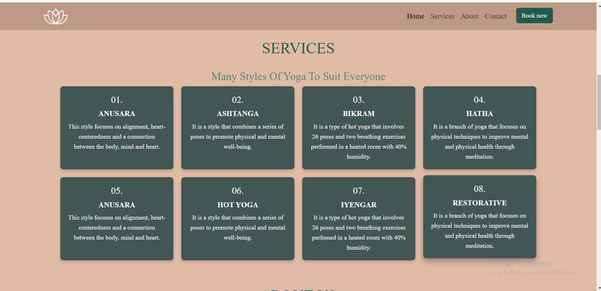

# Yoga-Studio

# Yoga Studio - README

Welcome to the Yoga Studio! This project is a dynamic and responsive webpage dedicated to promoting yoga and its many styles. It offers visitors insights into the benefits of yoga, detailed information about various yoga styles, and an opportunity to join classes through the "Join My Class" feature.

## Table of Contents

- [Project Overview](#project-overview)
- [Features](#features)
- [Technologies Used](#technologies-used)
- [File Structure](#file-structure)
- [How to Run the Project](#how-to-run-the-project)
- [Customization](#customization)
- [Contributing](#contributing)
- [License](#license)

---

## Project Overview

The Yoga Page is designed to:

1. Educate users about different styles of yoga, including Hatha, Ashtanga, Vinyasa, and more.
2. Provide detailed contact information for the yoga studio.
3. Facilitate easy enrollment into yoga classes through a dedicated appointment form.
4. Offer a visually appealing, responsive, and user-friendly interface across all devices.

---

## Features

1. **Homepage**

   - Introduction to yoga and its benefits.
   - Featured video with object-fit styling for aesthetic appeal.

2. **Yoga Styles Section**

   - Displays various yoga styles in a grid layout with descriptions.
   - Fully responsive design for mobile, tablet, and desktop views.

3. **Join My Class**

   - Dedicated section with a form to book yoga classes.
   - Smooth scrolling functionality to navigate directly to the form.

4. **Contact Information**

   - Location details, opening hours, and contact methods.
   - Smooth scrolling navigation for better user experience.

5. **Responsiveness**

   - Fully optimized for different screen sizes using CSS media queries.

---

## Technologies Used

- **HTML5**: Markup language for structuring the content.
- **CSS3**: Styling the webpage and ensuring responsiveness.
- **JavaScript**: Adding interactivity, such as smooth scrolling.
- **Font Awesome**: Icons for better visual representation.
- **Bootstrap**: Use of pre-designed user interface components.

---

## File Structure

```
project-directory/
|-- assets/
|   |-- css/
|   |   |-- styles.css   # Main CSS file
|   |-- video/
|   |   |-- yoga-video.mp4   # Featured yoga video
|   |-- images/
|       |-- logo.png      # Yoga logo
        |-- screenshot-of-home-page.jpg    #Homepage screenshot
        |-- screenshot-of-styles-section.jpg   #Yoga styles screenshot
        |-- screenshot-of-join-my-class.jpg    #Join my class form screenshot
|-- index.html             # Main HTML file
|-- join-us.html           # 
|-- thank-you.html         # 
|-- README.md              # Documentation
```

---

## How to Run the Project

1. Clone this repository:

   ```bash
   git clone <repository-url>
   ```

2. Navigate to the project directory:

   ```bash
   cd project-directory
   ```

3. Open the `index.html` file in your preferred web browser.

---

## Customization

1. **Adding Yoga Styles**:

   - Update the "Yoga Styles" section in the `index.html` file by adding new cards with a consistent format.

2. **Styling Changes**:

   - Modify the `styles.css` file in the `assets/css/` directory to customize colors, fonts, and layouts.

3. **Update Contact Information**:

   - Edit the Contact Information section in `index.html` to reflect accurate details.

---

## Screenshots 

### Homepage


### Yoga Styles Section


### Join My Class Form


## Contributing

Contributions are welcome! If you have suggestions or find issues, please:

1. Fork this repository.
2. Create a new branch:
   ```bash
   git checkout -b feature-name
   ```
3. Make your changes and commit them:
   ```bash
   git commit -m "Description of changes"
   ```
4. Push to your branch:
   ```bash
   git push origin feature-name
   ```
5. Open a pull request.

---

## License

This project is licensed under the MIT License. Feel free to use and modify it for personal or commercial purposes.

---

Thank you for exploring the Yoga Studio! Namaste. 🙏

