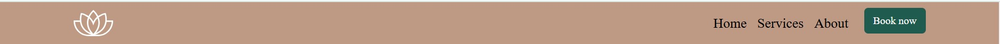
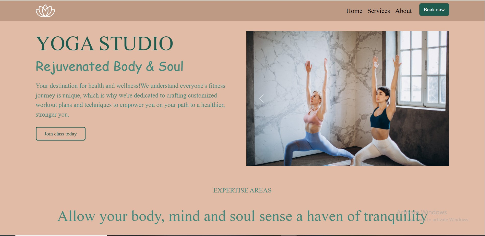
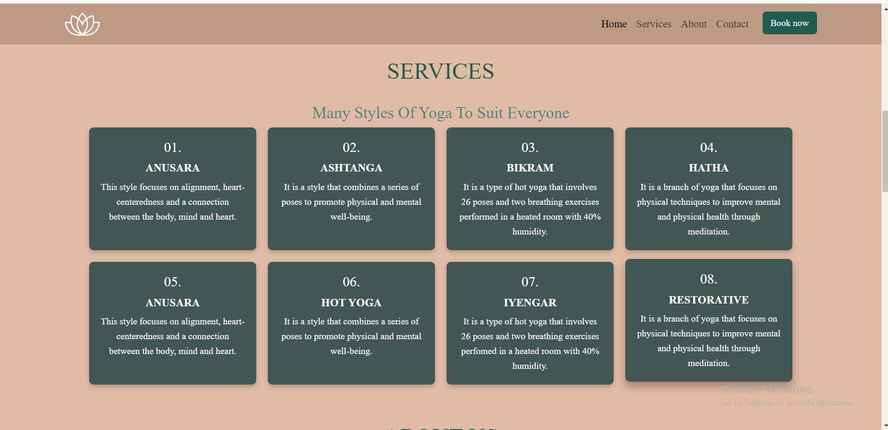
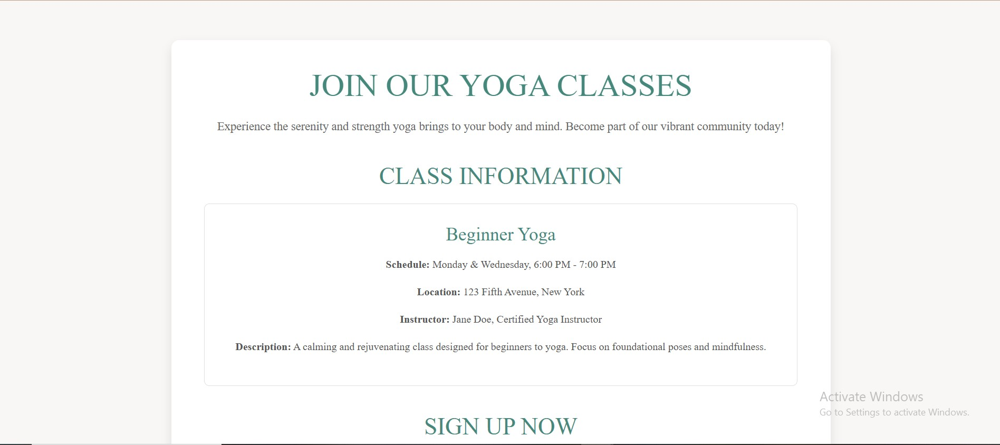
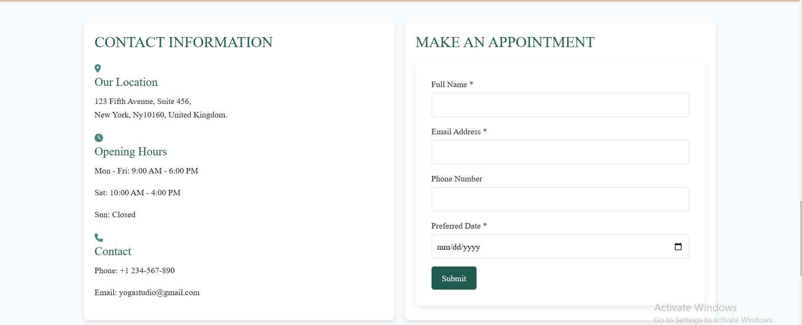
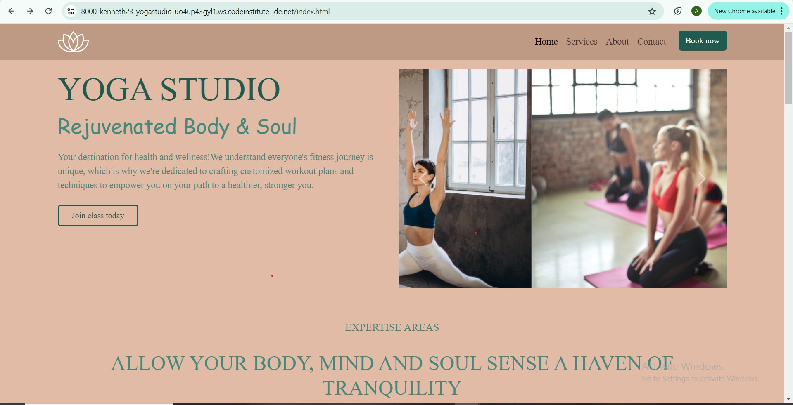
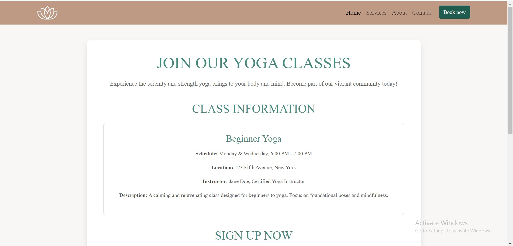

# Yoga-Studio

# Yoga Studio - README

Welcome to the Yoga Studio! This Yoga Studio Website project is a visually appealing, dynamic and responsive webpage dedicated to promoting yoga, designed to educate users about different styles of yoga. It offers visitors insights into the benefits of yoga, detailed information about various yoga styles, provides contact information for the studio and an opportunity to join classes through the "Join My Class" feature. The site is optimized for mobile, tablet, and desktop devices, ensuring a seamless user experience across all platforms.

## Table of Contents

- [Project Overview](#project-overview)
- [Features](#features)
- [Technologies Used](#technologies-used)
- [File Structure](#file-structure)
- [How to Run the Project](#how-to-run-the-project)
- [Customization](#customization)
- [Contributing](#contributing)
- [License](#license)

---

## Project Overview

The Yoga Page is designed to:

1. Educate users about different styles of yoga, including Hatha, Ashtanga, Vinyasa, and more.
2. Provide detailed contact information for the yoga studio.
3. Facilitate easy enrollment into yoga classes through a dedicated appointment form.
4. Offer a visually appealing, responsive, and user-friendly interface across all devices.

---

## User Stories

### User Story: Multi-Device Website Layouts

**As a** visitor to the website,  
**I want to** be able to easily navigate through different pages on mobile, tablet, and desktop,  
**so that** I can have a seamless experience across devices.

## User Goals

**First Time Visitor Goals:**

- As a First Time Visitor, I want to easily understand the main purpose of the website, so I can learn more about the yoga services offered.

- As a First Time Visitor, I want to be able to easily navigate through the website, so I can find information about classes, schedules, and instructors.

**Returning Visitor Goals**

- As a Returning Visitor, I want to see upcoming yoga classes and events, so that I can plan my schedule accordingly.

- As a Returning Visitor, I want to access detailed information about each yoga class, so that I can choose the one best suited to my level and goals.

- As a Returning Visitor, I want to find a way to contact the yoga center, so I can ask specific questions about the classes or instructors.

- As a Returning Visitor, I want to discover any community resources or events, so I can engage further with the yoga community.

**Frequent Visitor Goals**

- As a Frequent User, I want to check if there are any new classes or schedule changes, so I can stay up to date and adjust my plans.

- As a Frequent User, I want to easily contact the yoga center with specific requests or feedback, so I can receive personalized support or answers.

### Wireframes

### Desktop
- [Desktop Homepage Wireframe](https://wireframe.cc/pro/pp/16c36d6d9854763#1)
- [Desktop Join-our-class Wireframe](https://wireframe.cc/pro/pp/16c36d6d9854763#60qcxoh7)
- [Desktop thank-you Wireframe](https://wireframe.cc/pro/pp/16c36d6d9854763#z4ixa8q8)


## Additional Resources
-Full user story file: [User Story File](./USER_STORIES.md)

## Features

1. **Navbar**

- Navigation

   
   - Positioned at the top of the page.
   - Contains logo of the company on the left side.
   - Contains navigation links on the right side:
     
     - HOME - leads to the home page where users can learn about the company.
     - ABOUT - leads to the vision behind the company.
     - CONTACT - leads to the contact form page where users can fill out the form in order to get in touch with the company.

   - The links have animated hover effect.
   - The navigation is clear and easy to understand for the user.

2. **Homepage**

   
   - Introduction to yoga: informative content highlighting yoga and its benefits.
   - Featured images with object-fit styling for aesthetic appeal.

3. **Yoga Styles Section**
   
   
   - Grid Layout: Displays various yoga styles in a grid layout with descriptions.
   - Responsiveness: Fully responsive design for mobile, tablet, and desktop views.

4. **Join My Class**
    
   
   - Appointment Form: Dedicated section with a form to book yoga classes.
   - Smooth scrolling: functionality to navigate directly to the form.

5. **Contact Information**
   
   
   - Studio Details: Location details, opening hours, and contact methods.
   - Enhanced Navigation: Smooth scrolling navigation for better user experience.

6. **Responsiveness**

   - Fully optimized for different screen sizes using CSS media queries.

---

## Technologies Used

- **HTML**: Markup language for structuring the content.
- **CSS**: Styling the webpage and ensuring responsiveness.
- **JavaScript**: Adding interactivity, such as smooth scrolling.
- **Font Awesome**: Icons for better visual representation.
- **Bootstrap**: Use of pre-designed user interface components.
- **Pexels**: Used to get free and legal pictures and videos for websites.
- **Wireframe.cc**: Used to make a sketch for the website.
- **Markdown**: Used for formatting text.

---

## Design

**Color Scheme**

The website design for the Yoga Studio is built around a calming and elegant color palette to evoke a sense of balance, peace, and sophistication:

- Primary Color: #fff (White)
  
  - Used as the main background color to provide a clean and minimalistic feel.

- Secondary Color: #E1BBA6 (Light Beige)
  
  - Used for accents, such as section backgrounds or highlights, to add warmth and elegance.

- Highlight Color: #205B4F (Deep Teal)

  - Used for buttons, links, and important elements to draw attention.

- Highlight Color (Light): #46897c (Light Teal)

  - Used for hover states and subtle accents to complement the highlight color.

**Typography**

The typography for the Yoga Studio website reflects a harmonious blend of readability and artistic flair:

- Primary Font: "Lora", serif

  - Used for body text and headings to ensure content is easy to read while maintaining a professional tone.

- Secondary Font: "Dancing Script", cursive

  - Used for decorative elements such as titles, quotes, or testimonials to add a touch of creativity and elegance.

---

## File Structure

```
project-directory/
|-- assets/
|   |-- css/
|   |   |-- styles.css   # Main CSS file
|   |-- images/
|       |-- logo.png      # Yoga logo
        |-- screenshot-of-home-page.jpg    #Homepage screenshot
        |-- screenshot-of-styles-section.jpg   #Yoga styles screenshot
        |-- screenshot-of-join-my-class.jpg    #Join my class form screenshot
|-- index.html             # Main HTML file
|-- join-us.html           # Join us page
|-- thank-you.html         # Thank you page
|-- README.md              # Documentation
```

---

## How to Run the Project

1. Clone this repository:

   ```bash
   git clone <repository-url>
   ```

2. Navigate to the project directory:

   ```bash
   cd project-directory
   ```

3. Open the `index.html` file in your preferred web browser.

---

## Usage

- Homepage: Navigate to index.html to explore the yoga styles and learn about the studio.

- Book a Class: Use the "Join Class Today" section to enroll in yoga classes.

- Contact Information:  Scroll to the footer for studio location and contact details.

## Customization

1. **Adding Yoga Styles**:

   - Update the "Yoga Styles" section in the `index.html` file by adding new cards with a consistent format.

2. **Styling Changes**:

   - Modify the `styles.css` file in the `assets/css/` directory to customize colors, fonts, and layouts.

3. **Update Contact Information**:

   - Edit the Contact Information section in `index.html` to reflect accurate details.

---

## Screenshots 

### Homepage


### Yoga Styles Section


### Join My Class Form


---

## Testing

Please refer to the [Testing.md](./TESTING.md) file for all test-related documentation.

---

## Deployment

## Deployment to GitHub Pages

- The site was deployed to GitHub pages. The steps to deploy are as follows:
  - In the [GitHub repository](https://github.com/kenneth2-3/Yoga-Studio), navigate to the Settings tab.
  - From the source section drop-down menu, select the Main Branch, then click "Save".
  - The page will be automatically refreshed with a detailed ribbon display to indicate the successful deployment.

The live link can be found [here](https://kenneth2-3.github.io/Yoga-Studio/).

## Local Deployment

In order to make local copy of this project, you can clone it. In your IDE Terminal, type the following command to clone my repository:

  - git clone https://github.com/kenneth2-3/Yoga-Studio.git
  
## Contributing

Contributions are welcome! If you have suggestions or find issues, please:

1. Fork this repository.
2. Create a new branch:
   ```bash
   git checkout -b feature-name
   ```
3. Make your changes and commit them:
   ```bash
   git commit -m "Description of changes"
   ```
4. Push to your branch:
   ```bash
   git push origin feature-name
   ```
5. Open a pull request.

---

## Credits

- Media

   - All the images for the website were taken from [Pexels](https://www.pexels).
   - Carousel images:
     - [1st image;](assets/images/image-1.jpg)
     - [2nd image;](assets/images/image-2.jpg)
     - [3rd image;](assets/images/image-3.jpg)
   - About us images:
     - [1st image;](assets/images/image-4.jpg)
     - [2nd image;](assets/images/image-5.jpg)
     - [3rd image;](assets/images/image-6.jpg)
     - [4th image;](assets/images/image-7.jpg)

- Tools

  - [Google](https://www.google.com/) was used to get the map to yoga studio.
  - [Bootstrap](https://getbootstrap.com/) was used to get responsive codes.
  - [Font Awesome](https://fontawesome.com/) was used to get icons and social logos.

## License

This project is licensed under the MIT License. Feel free to use and modify it for personal or commercial purposes.

---

## Author

Yoga Studio Team

Thank you for exploring the Yoga Studio!

