# TESTING

## Compatibility

In order to confirm the correct functionality, responsiveness, and appearance:

  - The website was tested on the following browsers: Chrome, Firefox, Microsoft Edge.

  - Chrome:

  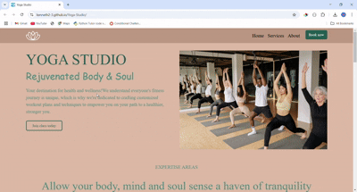

  - FireFox:

  

  - Microsoft Edge:

  

## Responsiveness

- The website was checked by devtools implemented in Firefox and Chrome browsers.

    - Home Page:
      
    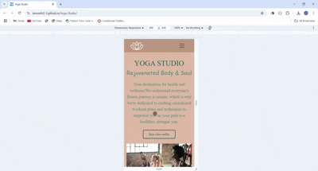

    - Join Us Page:

    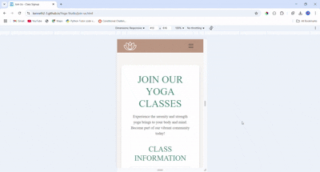

    - Thank You Page:

    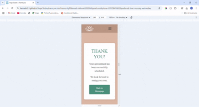

- The website was checked with [Responsive Website Design Tester](https://responsivedesignchecker.com/).

  - Desktop Screens:

  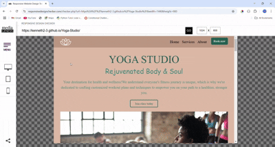
  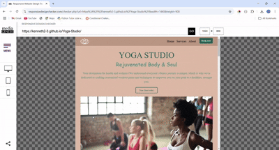
  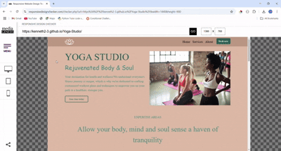
  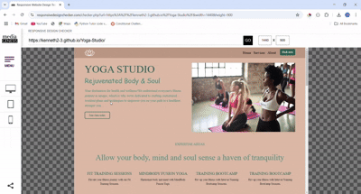
  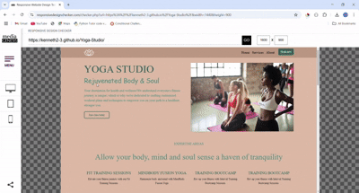
  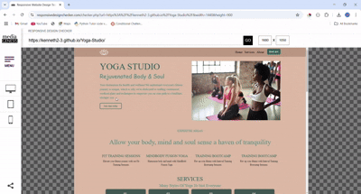
  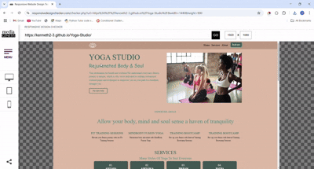
  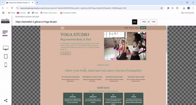