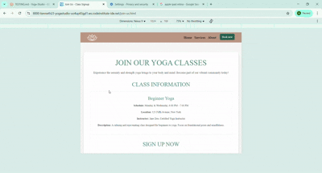

# TESTING

## Compatibility

In order to confirm the correct functionality, responsiveness, and appearance:

  - The website was tested on the following browsers: Chrome, Firefox, Microsoft Edge.

  - Chrome:

  

  - FireFox:

  

  - Microsoft Edge:

  

## Responsiveness

- The website was checked by devtools implemented in Firefox and Chrome browsers.

    - Home Page:
      
    

    - Join Us Page:

    

    - Thank You Page:

    

- The website was checked with [Responsive Website Design Tester](https://responsivedesignchecker.com/) and [Chrome](https://www.google.com/).

  - Desktop Screens:

  
  
  
  
  
  
  
  

  - Tablet Screens:

  
  
  
  
  
  
  
  
  

  - Mobile Screens:

  
  
  
  
  
  
  

  - The functionality of the links in the website was checked as well by different users.

  ## Manual Testing

  | feature | action | expected result | tested | passed | comments |
| --- | --- | --- | --- | --- | --- |
| Navbar | | | | | |
| Home | Click on the "Home" link | The user is redirected to the main page | Yes | Yes | - |
| Footer | | | | | |
| Instagram icon in the footer | Click on the Instagram icon | The user is redirected to the Instagram page | Yes | Yes | - |
| Facebook icon in the footer | Click on the Facebook icon | The user is redirected to the Facebook page | Yes | Yes | - |
| Twitter icon in the footer | Click on the Twitter icon | The user is redirected to the Twitter page | Yes | Yes | - |
| YouTube icon in the footer | Click on the YouTube icon | The user is redirected to the YouTube page | Yes | Yes | - |
| Home page | | | | | |
| "Contact" button in Home Page | Click on the "Contact" button | The user is redirected to the contact section in home page | Yes | Yes | - |
| "Book Now" button in Home Page | Click on the "Book Now" button | The user is redirected to the book now section | Yes | Yes | - |
| Full name input | Enter the full name | The full name is entered | Yes | Yes | If user doesn't enter the name, the error message appears |
| Email input | Enter the email | The email is entered | Yes | Yes | If user doesn't enter the email, the error message appears. If user enters not valid email, the error message appears |
| " Phone Number" button | Enter the phone number | The user is redirected to the thank you page | Yes | Yes | - |
| "Submit" button | Click on the "Submit" button | The user is redirected to the thank you page | Yes | Yes | - |
| Thank You page | | | | | |
| Thank you message | The user can be redirected to the home page by clicking the home button | The user is redirected to the home page | Yes | Yes | - |

---